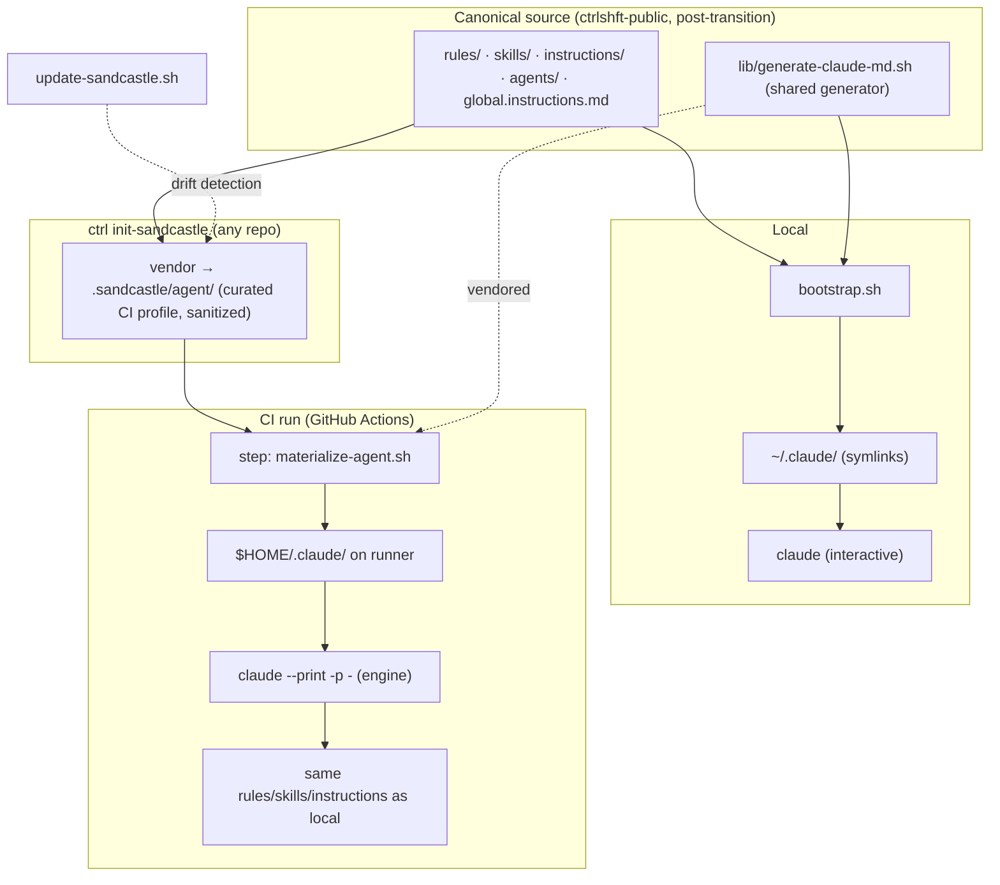

# ADR-005 — Sandcastle agent config parity (local ↔ CI)

**Status:** Proposed — implementation gated on the dotfiles-private → ctrlshft-public transition (see [Implementation sequencing](#implementation-sequencing))
**Date:** 2026-06-26
**Author:** Aaron Davis
**Deciders:** Maintainer (sole, at this stage)

---

## Context

Local agent sessions run against a fully materialized configuration. `bootstrap.sh` generates `~/.claude/CLAUDE.md` (which `@`-refs `global.instructions.md`) and symlinks `rules/`, `skills/`, `agents/`, `commands/`, and `hooks/` into the consumer directories. Claude Code loads all of it natively at session start.

Sandcastle CI runs the **same** Claude Code CLI — the engine invokes `claude --print --verbose --dangerously-skip-permissions --output-format stream-json --model <model> -p -` with the resolved prompt piped over stdin and `cwd: repoDir`. But on a GitHub-hosted runner, `$HOME=/home/runner` is empty and the repo checkout contains no `.claude/` agent payload (only `.claude/settings.json`). The CI agent therefore runs effectively naked: none of the 14 `rules/`, 33 `skills/`, 10 `instructions/`, 7 `agents/`, or `global.instructions.md` reach it. Its only injected context is the prompt template plus the two config-derived path pointers the engine substitutes (`CODING_STANDARDS`, `CONTEXT_DOC` — see `shft/engine/lib/resolve-prompt.ts`, `configPromptArgs()`), which pass file *paths*, not content.

Two facts make a clean fix possible:

1. The engine invokes the real `claude` CLI with `cwd: repoDir` and sets **no** config-disabling flag. Claude Code's native config loading is therefore fully available in CI — the payload only needs to be present on disk (user-level `$HOME/.claude/` or project-level `./.claude/`) before the engine step runs.
2. `init-sandcastle.sh` already vendors the engine (`.sandcastle/engine/`) per-repo and `update-sandcastle.sh` already does drift detection against the dotfiles source. The same vendoring pattern extends naturally to the agent payload.

The strategic goal is a "Russian doll": clone ctrl+shft, run `ctrl init-sandcastle` in any repo, and that repo carries the same agent infrastructure — so CI and local sessions run identical rules, skills, and instructions. This must scale across arbitrary repos the same way the workflows already do, without per-repo customization.

*One canonical payload feeds both `bootstrap.sh` (→ `~/.claude/`) and `materialize-agent.sh` (→ `$HOME/.claude/` on the runner), via the same CLI loading mechanism.*

---

## Decision

Achieve local↔CI agent parity by **vendoring a sanitized agent payload and materializing it onto the runner**, using Claude Code's native config loading as the seam. The engine is not modified.

1. **Vendor the agent payload.** `init-sandcastle.sh` vendors a curated, sanitized subset of `rules/`, `skills/`, `instructions/`, `agents/`, and `global.instructions.md` into `.sandcastle/agent/`, committed per-repo — consistent with how `.sandcastle/engine/` is already vendored.

2. **Materialize in CI.** A new `.sandcastle/scripts/materialize-agent.sh` (the CI analog of `bootstrap.sh`) copies `.sandcastle/agent/` into `$HOME/.claude/` on the runner and generates a CI-pathed `CLAUDE.md`. A "Materialize agent config" step runs it in every `agent-*.yml` workflow, between "Install engine dependencies" and "Run implement". Materializing to `$HOME/.claude/` (not the repo working tree) keeps the consumer repo clean — everything stays under `.sandcastle/` — and mirrors local user-level loading.

3. **One generator, no drift.** `bootstrap.sh` (local) and `materialize-agent.sh` (CI) share a single `lib/generate-claude-md.sh` so the generated `CLAUDE.md` cannot diverge between the two environments. The only difference is `@`-ref path rewriting (`~/dotfiles/...` locally vs `$HOME/.claude/...` in CI).

4. **Curated CI profile, sanitized by construction.** The vendored set excludes `skills/_local/`, `instructions/_local/`, client context, and machine-specific hooks (`hud-*`, secret guards). A `shft/templates/agent-profile.json` manifest enumerates exactly what ships and marks hooks as `ci-safe` vs `local-only`. The default is a curated profile (e.g. `do-work`, `tdd`, `systematic-debugging`, `code-review`, `atomic-commits`, the audit skills); `--full` opts into the complete shippable set. This inherits the Tier-1/Tier-2 boundary established in [ADR-001](ADR-001-vendor-boundary.md): only universal, maintainer-owned, sanitized content is shipped.

5. **Drift detection.** `update-sandcastle.sh` and `preflight-sandcastle.sh` are extended to track `.sandcastle/agent/` against the canonical source, reusing the existing engine/template drift pattern.

`commands/` are intentionally excluded — they are slash-triggered and never fire in non-interactive `-p` mode. `skills/` are included because Claude Code auto-matches them by description even in print mode.

---

## Implementation sequencing

This ADR is **Proposed, not Accepted**, because it depends on a prerequisite that is not yet met.

**Prerequisite:** Complete the dotfiles-private → ctrlshft-public transition — the handoff in which all code work is done in **ctrlshft-public first** and then merged back into **dotfiles-private**. Implementation begins only after that handoff is in place.

**Why the ordering matters:** The vendored payload must be the public/sanitized subset. Once ctrlshft-public is the canonical source where work originates, the vendored payload *is* public content by construction — there is no private-leak surface to police on every `init-sandcastle` run, and arbitrary repos can pull the same canonical infra cleanly. Implementing parity while dotfiles-private remains the origin would require the sanitization boundary to be enforced on every vendoring operation rather than guaranteed by the source of truth. The transition removes that hazard, so it must land first.

When the prerequisite is met, the work is sliced as:

- Slice 1 (HITL spike) — prove `$HOME/.claude/` (and `applyTo` rules) load under `claude --print` in CI.
- Slice 2 — extract `lib/generate-claude-md.sh`; refactor `bootstrap.sh` to call it (no local behavior change).
- Slice 3 — define `agent-profile.json` manifest (rules/skills/instructions/agents/hooks; ci-safe flags).
- Slice 4 — vendor the payload in `init-sandcastle.sh` (`.sandcastle/agent/` + scripts).
- Slice 5 — `materialize-agent.sh` + the "Materialize agent config" workflow step.
- Slice 6 — agent-payload drift detection in `update-sandcastle.sh` / `preflight-sandcastle.sh`.
- Slice 7 — dogfood end-to-end on claude-code-copilot; compare CI vs local behavior parity.

Slice 1 is the load-bearing spike: the one behavior that cannot be confirmed without a runner test is whether Claude Code honors `.claude/rules/` `applyTo` globs in non-interactive print mode. Everything downstream is gated on that result.

---

## Consequences

**Positive:**

- CI agents inherit the same `global.instructions.md`, rules, skills, instructions, and subagents as local sessions — behavior parity on commit hygiene, test discipline, and rule adherence.
- No engine fork or patch; the Claude Code CLI does the loading for free.
- `init-sandcastle` becomes a complete "drop ctrl+shft into this repo" operation, fulfilling the russian-doll scalability goal.
- Consumer repos stay clean — the agent payload lives under `.sandcastle/`, and runtime materialization targets `$HOME/.claude/` on the ephemeral runner.
- Sanitization is guaranteed by the source of truth (post-transition) rather than re-litigated per init.

**Negative:**

- Vendoring adds the agent payload to every initialized repo; it must be kept in sync via `update-sandcastle.sh`, adding a drift-maintenance surface.
- A curated CI profile risks omitting a skill or rule a given repo needs; `--full` is the escape hatch but widens the vendored footprint.
- Parity depends on a behavior (`applyTo` rule loading under `claude --print`) that must be empirically validated and re-checked across Claude Code CLI upgrades.

**Neutral:**

- This ADR selects the approach only. Slicing, the `generate-claude-md.sh` extraction, and live CI validation remain separate work, gated on the transition prerequisite.
- The proxy/secret baseline is unchanged — this builds on the `LITELLM_BASE_URL` / `LITELLM_MASTER_KEY` / `AGENT_PAT` contract from [ADR-004](ADR-004-sandcastle-hosted-proxy.md) and does not add new secrets.
- The four-tier disclosure model from [ADR-002](ADR-002-four-tier-disclosure.md) continues to govern what is eligible to ship in the payload.

---

## Alternatives considered

**Fetch the agent payload at runtime from ctrlshft-public:** A materialize step would `degit`/clone the published payload at a pinned version into `$HOME/.claude/` instead of vendoring it per-repo. Lighter repos and central updates, but it requires network access during every CI run and a stable published path, and it breaks the offline-reproducible, version-pinned property that vendoring gives. Recorded as the documented alternative for teams that prefer central control; vendoring is the default because it matches the existing engine-vendoring pattern and the russian-doll vision.

**Inject rules into the prompt via template variables:** Add an `{{AGENT_RULES}}`-style variable that inlines rule/skill content into the resolved prompt. Rejected — it duplicates what the CLI already does natively, bloats the prompt, loses `applyTo` glob semantics, and couples rule delivery to the engine's template layer.

**Materialize into the repo working tree (`./.claude/` + root `CLAUDE.md`):** Rejected as the default. A root `CLAUDE.md` can collide with a consumer repo's own, and project-level files pollute the tracked tree of repos that are not agent-first. User-level `$HOME/.claude/` on the ephemeral runner keeps the repo clean while giving identical loading.

**Self-hosted runner with a pre-baked `~/.claude/`:** Rejected. It conflicts with the [ADR-004](ADR-004-sandcastle-hosted-proxy.md) boundary that keeps GitHub Actions ephemeral, and it ties agent parity to host state instead of to the repo.

**Vendor the full payload by default:** Rejected as the default. Shipping all 33 skills plus every rule into every repo is heavy and, pre-transition, risks `_local/` leakage. A curated profile covers the bulk of CI value; `--full` remains available.

---

## ADR Note

Revisit when the dotfiles-private → ctrlshft-public transition completes — at that point promote to **Accepted** and begin Slice 1. Re-validate the `applyTo`-under-`--print` assumption whenever the pinned Claude Code CLI version changes.
