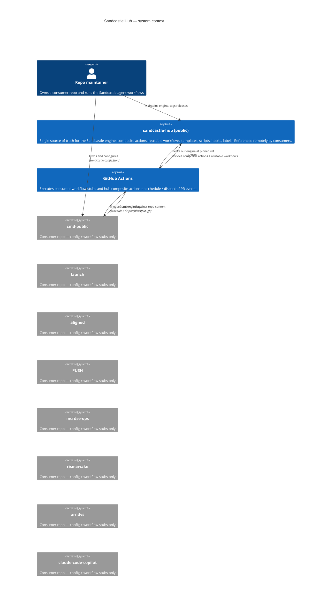
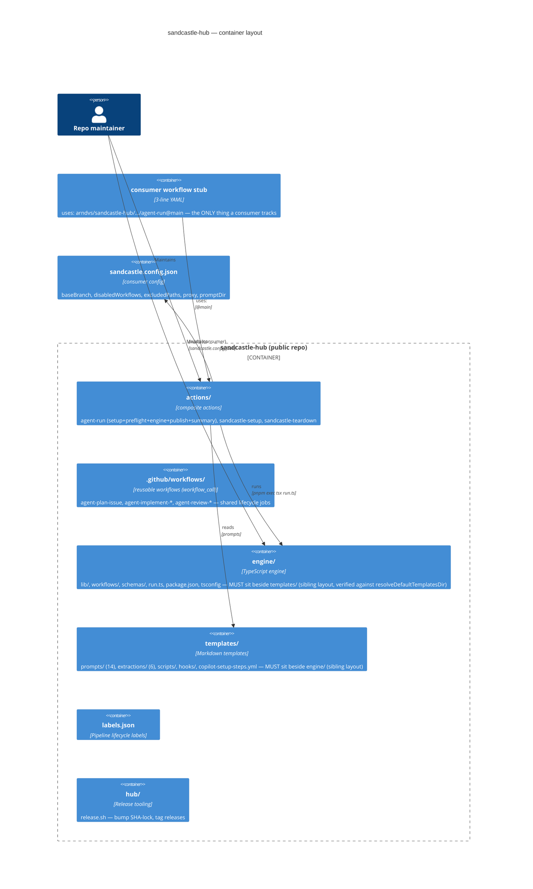
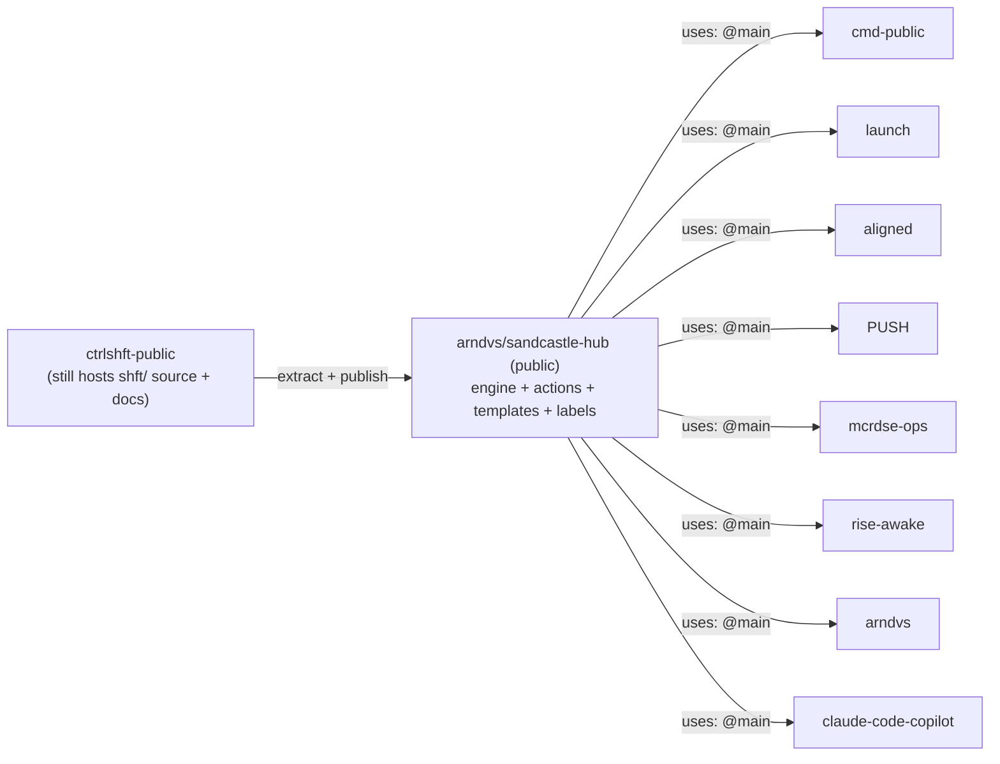

# Sandcastle Hub Architecture

> **Status:** Implemented (pilot) — hub live at `arndvs/sandcastle-hub`, cmd-public migrated (PR #19)
> **Date:** 2026-08-15
> **Author:** Aaron Davis
> **Applies to:** the public hub repo `arndvs/sandcastle-hub` and all 8 consumer repos

---

## 1. Problem Statement

Sandcastle ships its agent engine to consumers by **vendoring a full copy** into each repo:

- 84 tracked files under `.sandcastle/` (engine lib + workflows + schemas + templates + scripts + hooks + labels)
- 17 workflow YAMLs + 2 composite actions under `.github/`
- Each consumer runs `update-sandcastle.sh` to pull new versions

This model has proven structurally fragile across the 8 consumer repos:

1. **Drift is inevitable.** Nightly agents in any consumer can propose edits to vendored engine files (`cmd-public` #7/#8/#13), because the engine lives *inside* every repo.
2. **Re-vendor PRs are weekly churn.** Any producer change triggers 8 parallel update PRs with merge noise and conflict surface.
3. **The scope-hardening added after the fact is band-aid.** `DEFAULT_EXCLUDED_PATHS` + `disabledWorkflows` + backstops in `scope.ts` prevent agents from *proposing* engine changes, but the files still physically exist in every repo — 84 copies of the same source to keep in sync.
4. **There is no single source of truth at runtime.** The engine is compiled and run from wherever it was vendored, so "which version am I running?" depends on the last re-vendor timestamp.

The fix is to stop shipping the engine and start **referencing** it: a public hub repo that is the *only* copy of the engine, with consumers holding thin workflow stubs that `uses:` the hub's remote composite actions.

---

## 2. Goals / Non-Goals

### Goals

- **One engine copy.** The hub repo is the sole home of the Sandcastle engine, templates, scripts, hooks, and actions.
- **Thin consumers.** A consumer repo keeps its own `sandcastle.config.json`, `CONTEXT.md`, project prompts/standards, and ~3-line workflow stubs. Everything else is remote.
- **Zero drift by construction.** No vendored files → no drift detection, no re-vendor PRs, no `update-sandcastle.sh` for consumers.
- **Public, portfolio-proof.** The hub is a public repo showing clean senior-engineering architecture (this is also a recruitment/client credibility asset, per the user's explicit goal).
- **Backwards-compatible engine.** The engine already resolves templates relative to the workflow dir with multi-hop fallback (`resolveDefaultTemplatesDir`) and checks consumer-local `promptDir` overrides first (`resolvePrompt`) — it was designed to be hub-compatible. We keep this contract.

### Non-Goals

- No change to the engine's runtime semantics. Same workflows, same schemas, same `run.ts` entry.
- No new runtime language/tooling (stays TypeScript + tsx + pnpm).
- No change to the 4-tier disclosure or skill scope policies in `ctrlshft-public` (those are separate concerns).
- No migration of the private `dotfiles` internals — only the public Sandcastle surface moves to the hub.

---

## 3. Design Decisions

| Decision | Choice | Rationale |
| --- | --- | --- |
| Hub repo | **New public repo** `arndvs/sandcastle-hub` | `arndvs/sandcastle` is taken by a fork of mattpocock/sandcastle. A dedicated repo separates the engine product from the ctrlshft tooling monolith and gives the portfolio artifact a clean name. |
| Consumer refs | **`@main` + monthly SHA-lock review** | `@main` gives instant propagation (no re-vendor step at all); the drift workflow shifts from "re-vendor 8 repos" to "review and pin a SHA monthly". Branch-pin `@dev` rejected: consumers should run stable engine, not the dev branch. |
| Action model | **Composite actions** (remote, `uses: arndvs/sandcastle-hub/.sandcastle/actions/agent-run@main`) | Composite actions are self-contained, versionable via ref, and keep secrets/token plumbing local to the hub. A single `agent-run` action encapsulates setup + preflight + engine + publish + summary. |
| Workflow model | **Reusable workflows** for the 3 lifecycle-heavy jobs (plan/implement/review); **inline stubs** for the rest | `workflow_call` reduces consumer surface for the complex jobs; simple scheduled jobs stay as thin local stubs calling the composite action. Avoids the "reusable workflows can't call each other well" trap for the publish/summary steps. |
| Engine checkout strategy | **Hub action checks out hub repo at the pinned ref** into a scratch dir; consumer repo stays checked out in `github.workspace` | The engine needs the consumer's repo context (git, issues) at `github.workspace`, so the hub clone is side-by-side. `run.ts` is invoked with the consumer cwd as `repoDir`. |
| Consumer config | `sandcastle.config.json` stays **in the consumer repo** (project-owned) | Config is per-repo policy (baseBranch, disabledWorkflows, excludedPaths, proxy settings). Engine schema already supports defaults + env overrides; config loading is unchanged. |
| Prompt overrides | Consumer-local `promptDir` **overrides** hub templates by name | `resolvePrompt` already checks override-first. Consumers that need a custom prompt for workflow X drop `X.md` in their promptDir; everyone else gets the hub template. |
| Version pinning file | `.sandcastle/hub-version.json` (consumer-side, 1 file) | Records `{ ref: "main", lastPinnedSha, reviewedAt }`. Replaces the 84-file `.sandcastle-version` manifest. |
| Drift workflow | Consumer `sandcastle-drift.yml` becomes a **SHA-drift check** comparing `hub-version.json` against the hub's latest `main` | No file diffing. If the consumer's pinned SHA is older than 30 days or behind latest, it opens a "review hub SHA" PR. |
| Migration | **Pilot on `cmd-public` first**, then rollout | cmd-public has the richest workflow surface (all 17 workflows) and is the user's main dogfood repo. Prove the model there, then roll out. |
| `update-sandcastle.sh` | **Retired** for consumers; replaced by a hub-side release script | Consumers no longer vendor. The script's drift logic dies; a new `hub/release.sh` (in hub repo) bumps the SHA-lock and tags releases. |
| cmd-private | **Not a consumer** — no install, no migration | cmd-private has no sandcastle install (only `portfolio-digest.yml`). Out of scope until it opts in. |

---

## 4. Target Topology

### 4.1 System Context (C4)



### 4.2 Container diagram — hub repo layout



### 4.3 The thin-consumer shape

**Before (today) — per consumer: ~101 tracked files**

```
.sandcastle/          # 84 vendored files
.github/actions/      # 2 composite actions
.github/workflows/    # 17 workflow YAMLs
.sandcastle-version   # manifest
```

**After (hub model) — per consumer: 1 config + N stubs**

```
sandcastle.config.json          # project-owned config (already exists)
.github/workflows/agent-*.yml   # ~3-line stubs, one per enabled agent
.sandcastle/hub-version.json    # 1-file SHA-lock (ref + lastPinnedSha + reviewedAt)
```

A stub workflow looks like this (the entire file):

```yaml
name: "Agent: Architecture Review"

on:
  schedule:
    - cron: "0 9 * * 1-5"
  workflow_dispatch:

permissions:
  contents: read
  issues: write

jobs:
  architecture-review:
    runs-on: ubuntu-latest
    timeout-minutes: 45
    concurrency:
      group: agent-architecture-review
      cancel-in-progress: false
    steps:
      - uses: arndvs/sandcastle-hub/.sandcastle/actions/agent-run@main
        with:
          workflow: architecture-review
          ref: main
          token: ${{ secrets.AGENT_PAT || secrets.GITHUB_TOKEN }}
```

The composite `agent-run` action encapsulates: workflow-enabled check → proxy preflight → sandcastle setup → engine run (retry) → publish → summarize. Secrets are plumbed once, in the hub.

### 4.4 Repository topology after migration



---

## 5. Engine Compatibility (verified against source)

| Engine feature | Hub-mode behavior | Evidence |
| --- | --- | --- |
| Template resolution | `resolveDefaultTemplatesDir` walks up from the workflow module: `<hub>/engine/workflows/` → `../../templates/prompts` = `<hub>/templates/prompts`. **Requires sibling layout: `engine/` + `templates/`.** | `shft/engine/lib/default-template-paths.ts` (verified) |
| Dispatcher templates dir | `run.ts` computes `templatesDir = <run.ts-dir>/templates/prompts` = `<hub>/engine/../templates/prompts` = `<hub>/templates/prompts` — **same sibling target** as the workflow resolver | `.sandcastle/run.ts` (verified) |
| repoDir injection | `run.ts` defaults `repoDir = <run.ts-dir>/..` (the HUB in hub mode) — the action **must** pass `--repo ${{ github.workspace }}`; `parse-cli-args.ts` supports it and every workflow runner accepts `repoDir` | `parse-cli-args.ts`, `dispatch.ts` (verified) |
| Prompt overrides | `resolvePrompt` checks consumer `promptDir` first, then falls back to templates dir — consumers keep local overrides, hub supplies the rest | `shft/engine/lib/resolve-prompt.ts` |
| Config loading | `loadConfig` reads `sandcastle.config.json` from `cwd` (consumer workspace) — unchanged | `shft/engine/lib/config.ts` |
| Excluded paths | `resolveExcludedPaths` merges defaults + project — the vendored defaults (`DEFAULT_EXCLUDED_PATHS`) become **hub-engine defaults**, unchanged semantics | `shft/engine/lib/config.ts` |
| Scope backstop | `isProposalOutOfScope` unchanged — it just no longer needs to protect against vendored copies in consumers | `shft/engine/lib/scope.ts` |
| Workflow enable check | `check-workflow-enabled.sh` reads `sandcastle.config.json` from **cwd** — the hub action must run it from the consumer workspace | `shft/templates/scripts/check-workflow-enabled.sh` (verified) |

**Key runtime contract (verified):** the hub action must (1) check out the hub at the pinned ref, (2) run `run.ts <workflow> --repo ${{ github.workspace }}` from the hub engine dir, with **cwd = consumer workspace** (so git/gh/issue context and `sandcastle.config.json` resolve to the consumer repo). The engine's own files live in the hub checkout; all config/context reads come from the consumer cwd. No engine code changes are required — the sibling layout (`engine/` + `templates/`) satisfies both template resolvers as-is.

---

## 6. Hub → Consumer migration plan

### Phase 0 — Foundations (hub repo)
1. Create `arndvs/sandcastle-hub` (public, README + LICENSE + CODEOWNERS).
2. `git subtree split` or copy `shft/engine` from `ctrlshft-public` into the hub `engine/` (with tests).
3. Copy `shft/templates/` → `templates/`, `.github/actions/{sandcastle-setup,sandcastle-teardown}` → `actions/`, `labels.json`, scripts, hooks.
4. Author `actions/agent-run/action.yml` (composite) — the one action that replaces the per-repo setup/preflight/run/publish/summary chain.
5. Author reusable workflows for the lifecycle-heavy jobs (plan-issue, implement-issue, implement-pr, review, write-pr, merge-pr, update-branch).
6. Author `hub/release.sh` — bumps `hub-version.json` template, tags `vX.Y.Z`, updates `latest` pin.

### Phase 1 — Pilot on cmd-public
7. Migrate `cmd-public`: replace 101 vendored files with config + 17 stubs + `hub-version.json`.
8. Run the full workflow suite in `cmd-public` and compare results to the pre-migration baseline (same outputs, same labels, same issue creation).
9. Observe for 1–2 weeks: no drift, no re-vendor, agents proposing engine changes → must be zero.

### Phase 2 — Rollout
10. Roll the same migration to launch, aligned, PUSH, mcrdse-ops, rise-awake, arndvs, claude-code-copilot.
11. Retire `update-sandcastle.sh` consumer-side; point `ctrl` at the hub release script.

### Phase 3 — Hardening
12. SHA-drift workflow in consumers (`sandcastle-drift.yml` now checks `hub-version.json` vs hub latest).
13. Add a hub-side test workflow that runs the engine's own test suite on every PR to the hub.
14. Document the model (this document + README + ADR).

---

## 7. Risks & Mitigations

| Risk | Mitigation |
| --- | --- |
| Composite action `uses:` a repo-local path (`./`) — actions must reference their own repo via `uses: arndvs/sandcastle-hub/...` from the consumer | All hub-internal references use the fully-qualified `arndvs/sandcastle-hub/...` form. GitHub Actions supports referencing actions in other repos; the engine code itself is checked out by the action's first step, not by path assumptions. |
| `@main` instability (bad push breaks all consumers at once) | Monthly SHA-lock review + the consumer `hub-version.json` can pin to a SHA instead of `main` when a consumer wants stability. Release tagging gives a stable `vX.Y.Z` target. |
| Reusable workflows + composite actions both reading the engine from two different checkout paths | Single `agent-run` composite action owns the checkout + run; reusable workflows delegate to it. One path, one contract. |
| Secret sprawl (LITELLM, ANTHROPIC, AGENT_PAT) referenced from hub actions | Hub actions declare `token` input only; workflow-level `env:` from the consumer supplies the rest. Secrets stay in consumer repo secrets, never in the hub. |
| Consumer prompt overrides silently diverge from hub templates | The SHA-drift workflow also diffs override `promptDir` files against hub templates and flags them in the review PR. |
| Migration breakage on a consumer | Pilot on cmd-public, baseline compare, 1–2 week observation before any other repo moves. |
| Engine tests must keep passing in the hub | Phase 3 #13 adds the engine test suite to the hub's CI. The engine's 336 tests currently live only in `ctrlshft-public/shft/engine` — they move with the engine. |

---

## 8. What Stays Where

| Artifact | Lives in |
| --- | --- |
| Engine (lib/, workflows/, schemas/, run.ts, package.json) | **hub** (`engine/`) |
| Engine tests (test/, *.test.ts) | **hub** (moved with engine) |
| Prompt/extraction templates | **hub** (`templates/`) |
| Scripts (preflight, workflow-enabled, probes) | **hub** (`templates/scripts/` → `actions/` support) |
| Hooks (block-npx-tsc, guard-sandcastle-gitflow) | **hub** |
| Composite actions (agent-run, sandcastle-setup, sandcastle-teardown) | **hub** (`actions/`) |
| Reusable workflows | **hub** (`.github/workflows/`) |
| `labels.json` | **hub** |
| `sandcastle.config.json` | **consumer** (unchanged) |
| `CONTEXT.md`, `docs/adr/`, project prompts | **consumer** (unchanged) |
| `hub-version.json` (SHA-lock) | **consumer** (1 file) |
| Workflow stubs | **consumer** (N small files) |
| `update-sandcastle.sh` | **retired** (consumers) → replaced by `hub/release.sh` |
| ctrlshft-public `shft/engine/` | **migrated out** → hub becomes the new engine home; ctrlshft-public keeps docs, skills, agent workflows that reference the engine remotely |

---

## 9. Open Questions for Approval

1. **Repo name:** `arndvs/sandcastle-hub` (recommended) vs `arndvs/sandcastle-engine`. `arndvs/sandcastle` is taken by a fork.
2. **Pin strategy:** `@main` + monthly SHA-lock review (recommended) vs strict `@vX.Y.Z` tags only.
3. **ctrlshft-public's `shft/engine`:** migrate the engine out of ctrlshft-public into the hub (recommended — one engine home), or keep a mirrored copy (drift risk returns)?
4. **Migration scope:** pilot cmd-public → rollout (recommended), or one-shot all 8?
5. **cmd-private:** stays non-consumer (recommended) unless you want it migrated too.
6. **Reusable workflows vs stubs:** full reusable-workflow surface for all 17 agents (more abstraction), or composite-action stubs for everything (less YAML indirection)?

---
