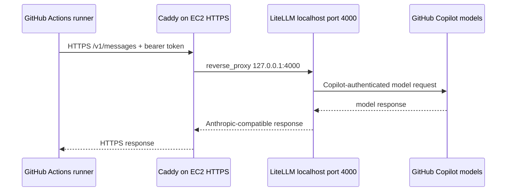

# Sandcastle hosted proxy EC2 runbook

This runbook documents the operational setup for the Sandcastle hosted proxy
selected in [ADR-004](../../docs/adr/ADR-004-sandcastle-hosted-proxy.md). The
goal is to give GitHub-hosted Actions a reachable Anthropic-compatible endpoint
without putting direct Anthropic credentials in repository secrets.

Do not commit real account IDs, public IPs, instance IDs, endpoint hostnames,
parameter values, OAuth cache contents, bearer keys, or generated `.env` files.

## Request flow



The GitHub Actions runner owns the repo checkout, issue/PR context, commits,
labels, and PR creation. The EC2 host is only the persistent model gateway.

## 1. Provision the EC2 host

Use one small Ubuntu or Debian EC2 instance for the proxy host. The host must
run in the same AWS region as its Parameter Store values unless the IAM policy
explicitly grants cross-region reads.

Baseline:

- Encrypted root EBS volume.
- IAM instance profile attached at launch.
- Security group allows public inbound `443/tcp`.
- Security group allows public inbound `80/tcp` only for ACME HTTP-01
  certificate issuance or HTTP-to-HTTPS redirects.
- No inbound `22/tcp` rule by default.
- No inbound rule for the LiteLLM app port, normally `4000/tcp`.

If SSH is needed for break-glass recovery, add a temporary `22/tcp` rule scoped
to the maintainer's current IP, fix SSM, then remove the SSH rule.

## 2. Create the instance role

Create an IAM role with EC2 as the trusted service. Attach:

- `AmazonSSMManagedInstanceCore`
- A scoped read-only Parameter Store policy for the proxy path

Example read policy with placeholders:

```json
{
  "Version": "2012-10-17",
  "Statement": [
    {
      "Sid": "ReadProxyParameters",
      "Effect": "Allow",
      "Action": [
        "ssm:GetParameter",
        "ssm:GetParameters",
        "ssm:GetParametersByPath"
      ],
      "Resource": "arn:aws:ssm:<region>:<account-id>:parameter/sandcastle-proxy/*"
    }
  ]
}
```

The EC2 role should not have `ssm:PutParameter`. Write parameters from an admin
identity, such as AWS CloudShell or an administrator workstation.

## 3. Verify SSM and IAM from the instance

Connect with EC2 Session Manager. If the instance is not listed as managed,
wait a few minutes and reboot once before using the temporary SSH fallback.

On a fresh Ubuntu image, install AWS CLI from the distro package manager if it
is missing:

```bash
sudo apt-get update
sudo apt-get install -y awscli
```

Verify the instance role:

```bash
aws sts get-caller-identity --region <region>
```

The ARN should be an assumed-role ARN for the EC2 instance profile.

Verify read-only Parameter Store access:

1. From CloudShell or an admin workstation, create a dummy SecureString:

   ```bash
   aws ssm put-parameter \
     --name "/sandcastle-proxy/test" \
     --value "hello-from-param-store" \
     --type SecureString \
     --region <region>
   ```

2. From the EC2 Session Manager shell, read it:

   ```bash
   aws ssm get-parameter \
     --name "/sandcastle-proxy/test" \
     --with-decryption \
     --region <region>
   ```

3. From CloudShell or an admin workstation, delete it:

   ```bash
   aws ssm delete-parameter \
     --name "/sandcastle-proxy/test" \
     --region <region>
   ```

An attempted `put-parameter` from the EC2 role should fail with access denied.
That confirms the host can read its own proxy parameters but cannot change them.

## 4. Assign a stable endpoint

Allocate and associate an Elastic IP before creating DNS records. Point the
chosen DNS name, for example `sandcastle-proxy.example.com`, at that Elastic IP.

The GitHub Actions secret `LITELLM_BASE_URL` should later use the HTTPS URL for
that DNS name.

## 5. Deploy `claude-code-copilot`

Install Docker and Caddy on the host, then clone or fetch a pinned
`claude-code-copilot` revision under an operational path such as
`/opt/claude-code-copilot`.

From the proxy repo:

```bash
python3 --version
make setup
```

`make setup` creates `.env` with restrictive file permissions. Keep `.env`
outside git and never paste its values into issues, logs, docs, or PR comments.

Store real long-lived proxy values in Parameter Store under
`/sandcastle-proxy/*` from CloudShell or an admin workstation. The EC2 role reads
those values during deployment or service startup; it does not write them.

## 6. Complete Copilot OAuth once

Run the proxy on the host outside Docker for the first OAuth device flow:

```bash
make start
```

Complete the browser/device-code flow when prompted, then stop the process.
Verify the cache exists:

```bash
ls -la ~/.config/litellm/github_copilot
```

The cache directory must persist across service restarts. Docker deployments
mount this cache into the container read-only.

## 7. Keep LiteLLM private to the host

The public internet must never reach LiteLLM directly. Caddy listens publicly;
LiteLLM binds only to localhost.

Docker run should publish the proxy like this:

```bash
# Set this to the user account that completed `make start` OAuth.
COPILOT_CACHE_DIR="${COPILOT_CACHE_DIR:?set COPILOT_CACHE_DIR to the OAuth user's ~/.config/litellm/github_copilot path}"
docker run --env-file .env \
  -v "${COPILOT_CACHE_DIR}:/root/.config/litellm/github_copilot:ro" \
  -p "127.0.0.1:${LITELLM_PORT:-4000}:4000" \
  claude-code-copilot:<pinned-tag-or-digest>
```

Use an explicit image tag or digest that matches the audited
`claude-code-copilot` revision on the host.
If running `docker` via `sudo`, set `COPILOT_CACHE_DIR` explicitly because
`$HOME` may resolve to `/root`.

Docker Compose must use the same localhost-only bind:

```yaml
ports:
  - "127.0.0.1:${LITELLM_PORT:-4000}:4000"
```

Do not use this on a shared or public host:

```yaml
ports:
  - "${LITELLM_PORT:-4000}:4000"
```

That form binds to all interfaces and can expose the proxy if a firewall rule is
changed later.

Verify the listener on the EC2 host:

```bash
ss -ltnp | grep "${LITELLM_PORT:-4000}"
```

Expected: `127.0.0.1:${LITELLM_PORT:-4000}`, not
`0.0.0.0:${LITELLM_PORT:-4000}`.

## 8. Configure Caddy

Caddy is the public HTTPS front door. A minimal Caddyfile shape is:

```caddyfile
sandcastle-proxy.example.com {
    reverse_proxy 127.0.0.1:4000
}
```

Caddy may use `80/tcp` for ACME HTTP-01 and redirect behavior. The model
endpoint authentication remains LiteLLM bearer auth via `LITELLM_MASTER_KEY`.

## 9. Verify from outside the instance

Run these from a machine that is not the EC2 host.

Direct app-port access must fail:

```bash
curl --connect-timeout 3 "http://<elastic-ip>:4000/health/readiness"
```

Unauthenticated HTTPS model calls must fail:

```bash
curl -i -X POST "https://sandcastle-proxy.example.com/v1/messages" \
  -H "Content-Type: application/json" \
  -d '{
    "model": "claude-sonnet-4-6",
    "max_tokens": 1,
    "messages": [{"role": "user", "content": "ping"}]
  }'
```

HTTPS readiness can be checked separately:

```bash
curl -i "https://sandcastle-proxy.example.com/health/readiness"
```

Authenticated HTTPS model calls should reach the proxy:

```bash
curl_config="$(mktemp "${TMPDIR:-/tmp}/litellm-curl-XXXXXX")"
chmod 600 "$curl_config"
trap 'rm -f "$curl_config"' EXIT
printf 'header = "Authorization: Bearer %s"\n' "$LITELLM_MASTER_KEY" > "$curl_config"

curl -i -X POST "https://sandcastle-proxy.example.com/v1/messages" \
  -K "$curl_config" \
  -H "Content-Type: application/json" \
  -d '{
    "model": "claude-sonnet-4-6",
    "max_tokens": 1,
    "messages": [{"role": "user", "content": "ping"}]
  }'
```

Prefer curl config files or GitHub Actions secret injection so bearer tokens are
not passed directly as command-line arguments.

## 10. Wire Sandcastle repos

For each repository using Sandcastle, set:

- `LITELLM_BASE_URL` to the hosted HTTPS endpoint.
- `LITELLM_MASTER_KEY` to the proxy bearer key.
- `AGENT_PAT` when label-triggered workflow chains need downstream workflow
  dispatch.

Then run a disposable Sandcastle issue-label smoke and verify the review, plan,
implementation, and final label transitions.

## Operations checklist

- Proxy service is supervised by Docker restart policy, systemd, or equivalent.
- Restarting the service does not require a new Copilot OAuth flow.
- Logs do not include auth headers, bearer keys, OAuth cache values, request
  bodies, or generated `.env` contents.
- Parameter rotation happens from an admin identity, followed by service restart
  or config reload.
- Caddy and OS packages are patched regularly.
- Temporary SSH rules are removed after recovery work.
